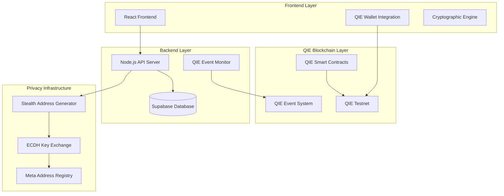

# Design Document: Aptos to QIE Migration

## Overview

This design document outlines the comprehensive migration of the PrivatePay application from Aptos blockchain to QIE network. QIE is an EVM-compatible Layer 1 blockchain that supports Solidity smart contracts, MetaMask integration, and Ethereum tooling. The migration will maintain all existing privacy features while leveraging QIE's high throughput (30,000 TPS), sub-second finality, and low gas fees. The system will continue to provide stealth address functionality for private payments but will operate exclusively on QIE testnet.

## Architecture

### High-Level System Architecture



### Migration Strategy

The migration follows a systematic approach leveraging QIE's EVM compatibility:

1. **Smart Contract Migration**: Convert Move contracts to Solidity for QIE EVM
2. **Frontend Adaptation**: Update React components to use MetaMask and QIE network
3. **Backend Integration**: Modify API services to interact with QIE EVM using ethers.js/web3.js
4. **Configuration Update**: Replace all Aptos-specific configurations with QIE EVM equivalents
5. **Testing & Validation**: Ensure all functionality works on QIE testnet with EVM tooling

## Components and Interfaces

### 1. QIE Smart Contracts (Solidity)

#### StealthAddressRegistry Contract
```solidity
// SPDX-License-Identifier: MIT
pragma solidity ^0.8.19;

contract StealthAddressRegistry {
    struct MetaAddress {
        bytes33 spendPubKey;
        bytes33 viewingPubKey;
        uint256 createdAt;
    }
    
    mapping(address => MetaAddress[]) public metaAddresses;
    
    event PaymentAnnouncement(
        address indexed recipient,
        uint256 metaAddressIndex,
        bytes33 ephemeralPubKey,
        address stealthAddress,
        uint32 viewHint,
        uint32 k,
        uint256 amount,
        uint256 timestamp
    );
    
    function registerMetaAddress(bytes33 calldata spendPub, bytes33 calldata viewingPub) external {
        metaAddresses[msg.sender].push(MetaAddress({
            spendPubKey: spendPub,
            viewingPubKey: viewingPub,
            createdAt: block.timestamp
        }));
    }
    
    function announcePayment(
        address recipient,
        uint256 metaAddressIndex,
        bytes33 calldata ephemeralPubKey,
        address stealthAddress,
        uint32 viewHint,
        uint32 k,
        uint256 amount
    ) external {
        emit PaymentAnnouncement(
            recipient,
            metaAddressIndex,
            ephemeralPubKey,
            stealthAddress,
            viewHint,
            k,
            amount,
            block.timestamp
        );
    }
    
    function getMetaAddress(address user, uint256 index) 
        external view returns (MetaAddress memory) {
        require(index < metaAddresses[user].length, "Invalid index");
        return metaAddresses[user][index];
    }
    
    function getMetaAddressCount(address user) external view returns (uint256) {
        return metaAddresses[user].length;
    }
}
```

#### PaymentManager Contract
```solidity
// SPDX-License-Identifier: MIT
pragma solidity ^0.8.19;

import "./StealthAddressRegistry.sol";

contract PaymentManager {
    StealthAddressRegistry public immutable registry;
    
    constructor(address _registry) {
        registry = StealthAddressRegistry(_registry);
    }
    
    function sendPrivatePayment(
        address recipient,
        uint256 metaIndex,
        uint32 k,
        bytes33 calldata ephemeralPubKey,
        address stealthAddress,
        uint32 viewHint
    ) external payable {
        require(msg.value > 0, "Amount must be greater than 0");
        
        // Transfer QIE to stealth address
        (bool success, ) = stealthAddress.call{value: msg.value}("");
        require(success, "Transfer failed");
        
        // Announce payment
        registry.announcePayment(
            recipient,
            metaIndex,
            ephemeralPubKey,
            stealthAddress,
            viewHint,
            k,
            msg.value
        );
    }
    
    function withdrawFromStealth(
        bytes33 calldata ephemeralPubKey,
        uint32 k,
        address payable to
    ) external {
        // In production, this would verify the caller owns the stealth address
        // For now, simplified version
        uint256 balance = address(this).balance;
        require(balance > 0, "No funds to withdraw");
        
        (bool success, ) = to.call{value: balance}("");
        require(success, "Withdrawal failed");
    }
}
```

### 2. Frontend Components

#### QIE Wallet Integration
- Replace Aptos wallet (Petra) with MetaMask for QIE EVM
- Update wallet connection using ethers.js or web3.js
- Adapt transaction signing for EVM format
- Support QIE network addition to MetaMask

#### Network Configuration
```typescript
// QIE Testnet Configuration for MetaMask
const QIE_TESTNET_CONFIG = {
  chainId: '0x...', // QIE testnet chain ID in hex
  chainName: 'QIE Testnet',
  nativeCurrency: {
    name: 'QIE',
    symbol: 'QIE',
    decimals: 18
  },
  rpcUrls: ['https://testnet-rpc.qie.digital'],
  blockExplorerUrls: ['https://testnet-explorer.qie.digital']
};
```

#### Token Management
- Replace APT with QIE native token
- Update token symbols and logos
- Adapt balance display for 18 decimals (EVM standard)
- Support ERC-20 tokens on QIE if needed

### 3. Backend Services

#### QIE Blockchain Service
```typescript
import { ethers } from 'ethers';

class QIEBlockchainService {
    private provider: ethers.JsonRpcProvider;
    private registryContract: ethers.Contract;
    private paymentContract: ethers.Contract;
    
    constructor() {
        this.provider = new ethers.JsonRpcProvider('https://testnet-rpc.qie.digital');
        this.registryContract = new ethers.Contract(
            REGISTRY_ADDRESS,
            REGISTRY_ABI,
            this.provider
        );
        this.paymentContract = new ethers.Contract(
            PAYMENT_ADDRESS,
            PAYMENT_ABI,
            this.provider
        );
    }
    
    async getMetaAddress(userAddress: string, index: number): Promise<MetaAddress> {
        return await this.registryContract.getMetaAddress(userAddress, index);
    }
    
    async announcePayment(params: PaymentParams): Promise<string> {
        const tx = await this.registryContract.announcePayment(...params);
        return tx.hash;
    }
    
    async monitorEvents(): Promise<PaymentEvent[]> {
        const filter = this.registryContract.filters.PaymentAnnouncement();
        const events = await this.registryContract.queryFilter(filter);
        return events.map(event => ({
            recipient: event.args.recipient,
            metaAddressIndex: event.args.metaAddressIndex.toNumber(),
            ephemeralPubKey: event.args.ephemeralPubKey,
            stealthAddress: event.args.stealthAddress,
            viewHint: event.args.viewHint,
            k: event.args.k,
            amount: event.args.amount.toString(),
            timestamp: event.args.timestamp.toNumber(),
            transactionHash: event.transactionHash,
            blockNumber: event.blockNumber
        }));
    }
    
    async validateAddress(address: string): Promise<boolean> {
        return ethers.isAddress(address);
    }
}
```

#### Event Monitoring Service
```typescript
class QIEEventMonitor {
    private service: QIEBlockchainService;
    
    async startMonitoring(): Promise<void> {
        // Set up event listeners for real-time monitoring
        const filter = this.service.registryContract.filters.PaymentAnnouncement();
        this.service.registryContract.on(filter, this.handlePaymentEvent.bind(this));
    }
    
    private async handlePaymentEvent(
        recipient: string,
        metaAddressIndex: number,
        ephemeralPubKey: string,
        stealthAddress: string,
        viewHint: number,
        k: number,
        amount: bigint,
        timestamp: number,
        event: ethers.Log
    ): Promise<void> {
        const paymentEvent: PaymentEvent = {
            recipient,
            metaAddressIndex,
            ephemeralPubKey,
            stealthAddress,
            viewHint,
            k,
            amount: amount.toString(),
            timestamp,
            transactionHash: event.transactionHash,
            blockNumber: event.blockNumber
        };
        
        await this.updateDatabase([paymentEvent]);
    }
    
    async processPaymentEvents(events: PaymentEvent[]): Promise<void> {
        // Process batch events
        for (const event of events) {
            await this.updateDatabase([event]);
        }
    }
    
    async updateDatabase(payments: PaymentEvent[]): Promise<void> {
        // Update Supabase with QIE payment events
    }
}
```

## Data Models

### Core Data Structures

```typescript
interface QIEMetaAddress {
    spendPubKey: string;      // 33-byte compressed secp256k1 public key (hex)
    viewingPubKey: string;    // 33-byte compressed secp256k1 public key (hex)
    createdAt: number;
    qieAddress: string;       // EVM format address (0x...)
}

interface QIEPaymentEvent {
    recipientAddress: string;     // EVM address
    metaAddressIndex: number;
    ephemeralPubKey: string;      // 33-byte hex string
    stealthAddress: string;       // EVM address
    viewHint: number;
    k: number;
    amount: string;               // Wei amount as string
    timestamp: number;
    transactionHash: string;      // EVM transaction hash
    blockNumber: number;
}

interface QIETransaction {
    hash: string;                 // EVM transaction hash
    from: string;                 // EVM address
    to: string;                   // EVM address
    value: string;                // Wei amount as string
    gasUsed: string;
    gasPrice: string;
    blockNumber: number;
    timestamp: number;
    status: number;               // 1 for success, 0 for failure
}

interface QIENetworkConfig {
    chainId: number;              // QIE chain ID
    chainName: string;            // "QIE Testnet"
    rpcUrl: string;               // QIE RPC endpoint
    explorerUrl: string;          // QIE block explorer
    nativeCurrency: {
        name: string;             // "QIE"
        symbol: string;           // "QIE"
        decimals: number;         // 18
    };
}
```

### Database Schema Updates

```sql
-- Update existing tables for QIE EVM
ALTER TABLE users ADD COLUMN qie_address VARCHAR(42); -- EVM address format
ALTER TABLE meta_addresses ADD COLUMN qie_address VARCHAR(42);
ALTER TABLE payments ADD COLUMN qie_transaction_hash VARCHAR(66); -- EVM tx hash
ALTER TABLE payments ADD COLUMN qie_block_number BIGINT;
ALTER TABLE payments ADD COLUMN gas_used VARCHAR(20);
ALTER TABLE payments ADD COLUMN gas_price VARCHAR(20);

-- New QIE-specific tables
CREATE TABLE qie_contracts (
    id SERIAL PRIMARY KEY,
    name VARCHAR(50) NOT NULL,
    address VARCHAR(42) NOT NULL, -- EVM address
    abi JSONB NOT NULL,
    deployed_at TIMESTAMP DEFAULT NOW(),
    chain_id INTEGER NOT NULL
);

CREATE TABLE qie_network_config (
    id SERIAL PRIMARY KEY,
    network_name VARCHAR(20) NOT NULL,
    chain_id INTEGER NOT NULL,
    rpc_url VARCHAR(255) NOT NULL,
    explorer_url VARCHAR(255) NOT NULL,
    native_currency_name VARCHAR(10) NOT NULL,
    native_currency_symbol VARCHAR(10) NOT NULL,
    native_currency_decimals INTEGER NOT NULL DEFAULT 18,
    is_active BOOLEAN DEFAULT FALSE
);

-- Insert QIE testnet configuration
INSERT INTO qie_network_config (
    network_name, chain_id, rpc_url, explorer_url,
    native_currency_name, native_currency_symbol, native_currency_decimals, is_active
) VALUES (
    'QIE Testnet', 0, 'https://testnet-rpc.qie.digital', 'https://testnet-explorer.qie.digital',
    'QIE', 'QIE', 18, true
);
```

## Correctness Properties

*A property is a characteristic or behavior that should hold true across all valid executions of a system-essentially, a formal statement about what the system should do. Properties serve as the bridge between human-readable specifications and machine-verifiable correctness guarantees.*

### Property Reflection

After analyzing all acceptance criteria, several properties can be consolidated to eliminate redundancy:

- Network connection properties (1.1, 1.5, 6.1) can be combined into a comprehensive network isolation property
- UI display properties (1.3, 5.1, 5.2, 5.4) can be consolidated into a QIE branding consistency property  
- Address format properties (3.1, 4.2, 6.4) can be combined into a QIE address compatibility property
- Event monitoring properties (2.3, 4.1, 6.3) can be unified into a QIE event system property
- Configuration properties (7.1, 7.2, 7.3, 7.5) can be consolidated into a QIE configuration consistency property

### Correctness Properties

Property 1: QIE Network Isolation
*For any* application startup or network operation, all connections should only target QIE network endpoints and no Aptos connections should exist
**Validates: Requirements 1.1, 1.5, 6.1**

Property 2: QIE Wallet Compatibility
*For any* wallet connection attempt, only QIE-compatible wallets should be accepted and supported
**Validates: Requirements 1.2**

Property 3: QIE Branding Consistency
*For any* UI component or display element, QIE branding, network names, and token symbols should be shown instead of Aptos equivalents
**Validates: Requirements 1.3, 5.1, 5.2, 5.4**

Property 4: Aptos Dependency Elimination
*For any* code analysis, no Aptos-related packages, imports, or dependencies should remain in the system
**Validates: Requirements 1.4**

Property 5: QIE Contract Integration
*For any* smart contract operation, the system should interact exclusively with QIE-deployed contracts for meta address registration and payment management
**Validates: Requirements 2.2, 2.4**

Property 6: QIE Event System
*For any* payment announcement or blockchain monitoring, events should be emitted and monitored exclusively on QIE network
**Validates: Requirements 2.3, 4.1, 6.3**

Property 7: QIE Cryptographic Compatibility
*For any* cryptographic operation, the system should use QIE-compatible key formats and address derivation methods
**Validates: Requirements 2.5, 3.3**

Property 8: QIE Address Format Compliance
*For any* stealth address generation or private key derivation, the results should conform to QIE address format and validation rules
**Validates: Requirements 3.1, 4.2, 6.4**

Property 9: QIE Token Operations
*For any* payment transaction, the system should transfer QIE native tokens or QIE-based tokens exclusively
**Validates: Requirements 3.2**

Property 10: QIE Payment Link Generation
*For any* payment link creation, the generated stealth addresses should be QIE-compatible and functional
**Validates: Requirements 3.4**

Property 11: QIE Transaction Monitoring
*For any* blockchain monitoring operation, the system should scan only QIE blockchain for payment events and transactions
**Validates: Requirements 3.5**

Property 12: QIE Fund Withdrawal
*For any* fund withdrawal operation, transfers should occur between QIE addresses on QIE network
**Validates: Requirements 4.3**

Property 13: QIE Balance Display
*For any* balance display, the system should show QIE token amounts, symbols, and values
**Validates: Requirements 4.4**

Property 14: QIE Address Derivation Consistency
*For any* multiple payment scenario, all stealth addresses should be derived correctly using QIE-compatible methods
**Validates: Requirements 4.5**

Property 15: QIE Explorer Integration
*For any* transaction link generation, URLs should point to QIE blockchain explorer
**Validates: Requirements 5.3**

Property 16: QIE Documentation Consistency
*For any* help or documentation access, content should provide QIE-specific guidance and information
**Validates: Requirements 5.5**

Property 17: QIE Transaction Data Format
*For any* transaction data storage, QIE transaction hashes, block numbers, and format should be used
**Validates: Requirements 6.2**

Property 18: QIE Transaction Processing
*For any* payment processing, QIE transaction formats and gas fee handling should be applied
**Validates: Requirements 6.5**

Property 19: QIE Configuration Consistency
*For any* application configuration, environment variables, deployment settings, and test execution should use QIE-specific values and endpoints
**Validates: Requirements 7.2, 7.3, 7.4, 7.5**

Property 20: Meta Address Migration Integrity
*For any* user account migration, meta address relationships and data should be preserved correctly
**Validates: Requirements 8.1**

Property 21: QIE Payment Link Migration
*For any* existing payment link access, the system should redirect to QIE-based stealth address generation
**Validates: Requirements 8.2**

Property 22: Network Transaction Distinction
*For any* historical data access, the system should clearly distinguish between Aptos and QIE transactions
**Validates: Requirements 8.3**

Property 23: QIE User Onboarding
*For any* existing user onboarding, the system should provide QIE wallet setup guidance
**Validates: Requirements 8.4**

Property 24: Cross-Network Privacy Preservation
*For any* stealth address generation, unlinkability should be maintained across both Aptos and QIE networks
**Validates: Requirements 8.5**

## Error Handling

### QIE Network Errors
- Connection failures to QIE RPC endpoints
- Transaction failures due to insufficient gas or network congestion
- Smart contract interaction errors
- Invalid QIE address format errors

### Migration-Specific Errors
- Incomplete Aptos dependency removal
- Configuration mismatch between Aptos and QIE
- Data migration integrity issues
- Wallet compatibility problems

### Recovery Strategies
- Automatic retry mechanisms for network failures
- Fallback RPC endpoints for QIE network
- Data validation and rollback for migration errors
- User guidance for wallet setup issues

## Testing Strategy

### Dual Testing Approach

The testing strategy combines unit testing and property-based testing to ensure comprehensive coverage:

**Unit Testing Requirements:**
- Unit tests verify specific examples, edge cases, and error conditions
- Integration tests verify component interactions with QIE network
- Migration tests verify successful transition from Aptos to QIE
- End-to-end tests verify complete user workflows on QIE

**Property-Based Testing Requirements:**
- Property-based testing library: **fast-check** for TypeScript/JavaScript components
- Each property-based test configured to run minimum 100 iterations
- Each property-based test tagged with format: '**Feature: aptos-to-qie-migration, Property {number}: {property_text}**'
- Each correctness property implemented by a single property-based test
- Property tests verify universal properties across all QIE network interactions

**Testing Framework Integration:**
- Jest for unit testing and property-based testing
- Cypress for end-to-end testing
- QIE testnet for integration testing
- Mock QIE network responses for isolated testing

### Test Categories

1. **Network Isolation Tests**: Verify no Aptos connections remain
2. **Smart Contract Migration Tests**: Verify QIE contract functionality
3. **Cryptographic Compatibility Tests**: Verify QIE key format compatibility
4. **UI/UX Migration Tests**: Verify QIE branding and interface updates
5. **Data Migration Tests**: Verify user data preservation and format conversion
6. **Performance Tests**: Verify QIE network performance meets requirements