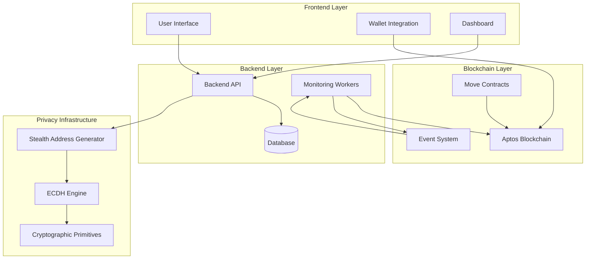
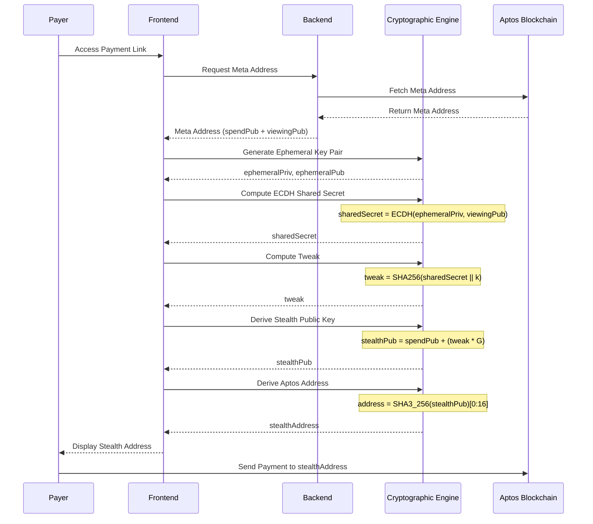
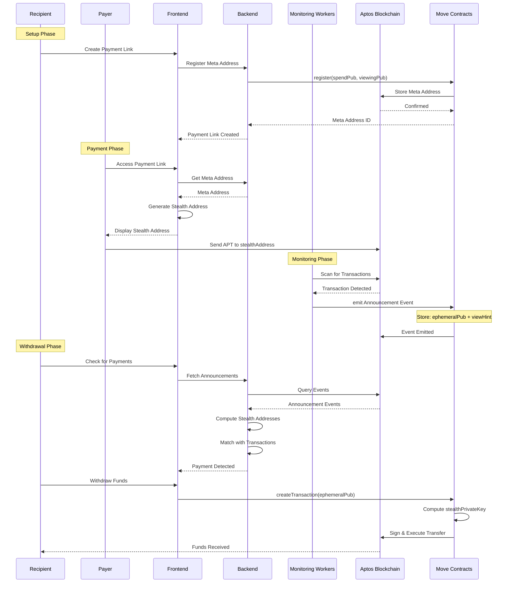
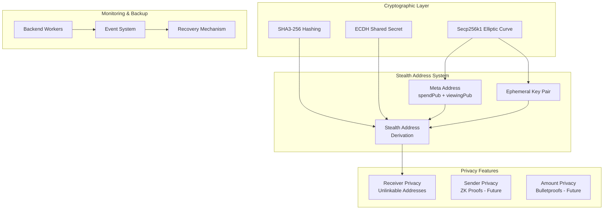
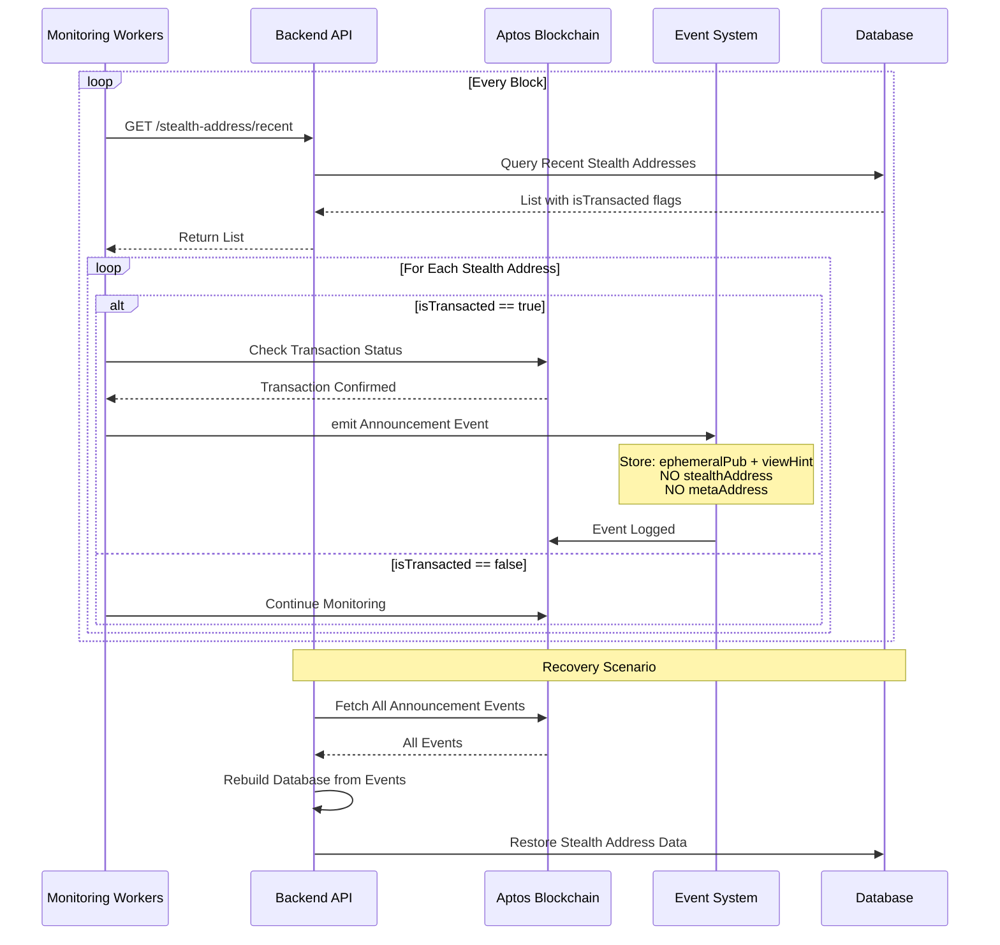
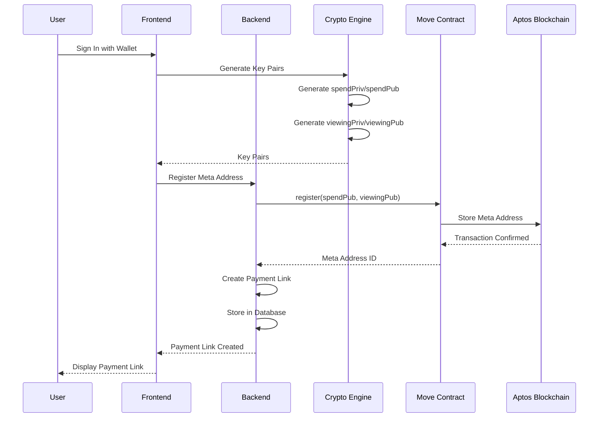
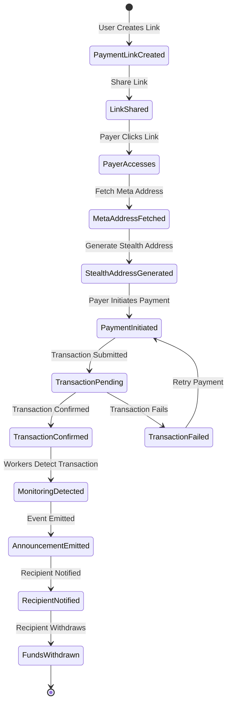
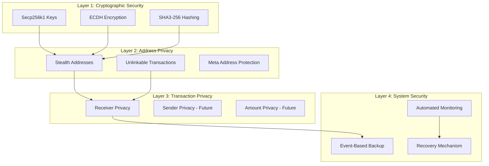

# PrivatePay 🐙

> **The first on-chain untraceable, unidentifiable private payments on Aptos**

[](https://aptoslabs.com/)
[](https://www.typescriptlang.org/)
[](https://move-language.github.io/)

**Simply means:** Stealth Crypto Payments using multilayer forks

Powered by ECDH + secp256k1 + BIP 0352/EIP 5564 + ROFL DarkPool Mixer

---

## 🚨 The Problem: Financial Privacy is Broken

### Real-Life Story

**Alice**, a legendary dev, won the Move AI Hack and received $13,000 prize money.

**Bob**, another participant who won another prize in the same hackathon, discovered his co-founder wasn't trustworthy about receiving prize money. Bob texted all 12 winners asking for the organizer's wallet address. Within minutes, using blockchain explorers and intelligence tools, he identified:
- Which wallet belonged to whom
- Exactly how much each person received
- Their entire transaction history

**This is a serious concern.** Nobody wants their wallet exposed — it makes them vulnerable to targeted attacks, extortion, and financial loss.

### The Core Issues

❌ **Payments on public blockchains are NOT private**
- Traceable through tools like Arkham Intelligence
- Trackable via Dune Analytics and explorers
- Identifiable by anyone with basic skills

❌ **Results:**
- Fear of transacting
- Inconvenience for legitimate users
- Financial loss from targeted attacks
- Privacy violations for everyone

---

## ✅ The Solution: PrivatePay

**Where every transaction is fully private, anonymous, unidentifiable, and untrackable.**

### Core Benefits

✨ **Sender privacy**: Your wallet is never linked to the transaction
✨ **Receiver privacy**: Recipients' identities remain hidden
✨ **Observer blindness**: Third parties see nothing linkable
✨ **Simple UX**: Like Stripe links, but every transaction is a new, invisible wallet

### Key Features

🔒 **Infinite Untraceable Stealth Accounts**
- Each payment generates a fresh stealth sub-account
- Unlimited transactions, unlimited mixers
- One single DarkPool

💼 **Static Payment Links**
- Share a single payment link (e.g., `amaan.privatepay.me`)
- Each access generates a unique stealth address
- No complex setup required

🔐 **Complete Unlinkability**
- Sender cannot identify receiver
- Receiver cannot identify sender
- Observers see nothing linkable

---

## 🚀 How It Works

### Three-Step Process

#### 1. Create Payment Link 🔗
- User creates static payment link (e.g., `amaan.privatepay.me`)
- System generates meta address (static identifier)
- Link can be shared publicly without privacy risk

#### 2. Receive Payment 💸
- Payer accesses link → generates unique stealth address
- Payment sent to stealth address on Aptos
- Transaction is unlinkable to recipient's identity

#### 3. Manage Funds 💰
- Recipient monitors stealth addresses automatically
- Funds can be withdrawn to main wallet
- Full transaction history in private dashboard

---

## 🔧 Technology Stack

### Privacy Infrastructure

```
🔐 Cryptographic Primitives
├─ Secp256k1 elliptic curve cryptography
├─ SHA3-256 hashing for address derivation
└─ Secure random number generation

🤝 ECDH (Elliptic Curve Diffie-Hellman)
├─ Shared secret computation
├─ Key exchange protocol
└─ Perfect forward secrecy

🎭 Stealth Address Protocol (SSAP)
├─ Adapted from BIP 0352 / EIP 5564
├─ Unique address per transaction
└─ Complete unlinkability

🌊 DarkPool Mixer (In Progress)
├─ Runtime Offchain Logic (ROFL) integration
├─ Homomorphic encryption
└─ Monero-style Ring Signatures & RingCT

🔍 Automated Monitoring
├─ Backend workers for transaction detection
├─ Event-based backup system
└─ Resilient recovery mechanism
```

### Built With

- **Blockchain**: Aptos (Move smart contracts)
- **Frontend**: React + TypeScript + Vite
- **Backend**: Node.js + Express
- **Database**: Supabase (PostgreSQL)
- **Cryptography**: @noble/secp256k1, @noble/hashes
- **Wallet**: Petra (Aptos wallet)
- **Rewards**: Photon SDK integration

---

## 📊 Market Opportunity

### Total Addressable Market (TAM)

| Market | Size | Growth |
|--------|------|--------|
| 💰 Global payment processing | $160B annually | - |
| 🪙 Crypto payment market | $624M | 16.6% CAGR |
| 🔒 Privacy-focused solutions | $1.2B | Growing |
| 👥 Crypto users worldwide | 590M+ | Expanding |

### Target Users

- **Individuals**: Privacy-conscious crypto users
- **Freelancers**: Receive payments without exposing income
- **Businesses**: Accept payments without revealing revenue
- **DAOs**: Anonymous treasury management
- **Hedge Funds**: Private money movements
- **High Net Worth**: Protection from targeted attacks

---

## 🎯 Competitive Landscape

### Why PrivatePay Wins


## ⚡ Future Roadmap

### Phase 1: Core Platform ✅
- ✅ Stealth address generation
- ✅ Payment link system
- ✅ Dashboard and monitoring
- ✅ Aptos wallet integration

### Phase 2: Enhanced Privacy 🚧
- 🚧 Zero-knowledge proofs (Plonky2)
- 🚧 Bulletproofs for amount hiding
- 🚧 Advanced DarkPool integration
- 🚧 ROFL-style monitoring

### Phase 3: Payment Expansion 🔮
- 🔮 Private credit and debit card payments
- 🔮 Private cross-chain bridges
- 🔮 Disposable wallets

### Phase 4: Enterprise Features 🔮
- 🔮 Hedge fund money moves
- 🔮 API marketplace
- 🔮 White-label solutions
- 🔮 Compliance tools

### Endless Possibilities
- No more "James Waynn Exposer" incidents
- End to HyperLiquid wallet reveals
- Protection for high-value transactions
- Privacy for everyone, everywhere

---

## 🏗️ Architecture

### System Overview

```
┌─────────────────┐
│   User Wallet   │
│  (Petra/Aptos)  │
└────────┬────────┘
         │
         ▼
┌─────────────────┐      ┌──────────────────┐
│    Frontend     │◄────►│   Backend API    │
│  (React + TS)   │      │  (Node.js)       │
└────────┬────────┘      └────────┬─────────┘
         │                        │
         ▼                        ▼
┌─────────────────┐      ┌──────────────────┐
│ Stealth Address │      │   Supabase DB    │
│    Generator    │      │  (PostgreSQL)    │
└────────┬────────┘      └──────────────────┘
         │
         ▼
┌─────────────────────────────────┐
│      Aptos Blockchain           │
│  ┌──────────────────────────┐   │
│  │   Move Smart Contracts   │   │
│  │  - StealthSigner         │   │
│  │  - Payment Manager       │   │
│  │  - Event System          │   │
│  └──────────────────────────┘   │
└─────────────────────────────────┘
```

### Cryptographic Flow

```
1. Meta Address Generation
   ├─ Generate spend key pair (spendPriv, spendPub)
   ├─ Generate viewing key pair (viewingPriv, viewingPub)
   └─ metaAddress = (spendPub, viewingPub)

2. Stealth Address Generation
   ├─ Generate ephemeral key pair (ephemeralPriv, ephemeralPub)
   ├─ Compute shared secret: ECDH(ephemeralPriv, viewingPub)
   ├─ Compute tweak: SHA256(sharedSecret || k)
   ├─ Derive stealth public key: stealthPub = spendPub + (tweak * G)
   └─ Derive Aptos address: SHA3_256(stealthPub)[0:16]

3. Payment Detection
   ├─ Recipient computes: ECDH(viewingPriv, ephemeralPub)
   ├─ Checks view hint matches
   ├─ Derives stealth address
   └─ Checks blockchain for funds

4. Fund Withdrawal
   ├─ Compute stealth private key: stealthPriv = spendPriv + tweak
   ├─ Sign transaction with stealthPriv
   └─ Transfer funds to main wallet
```

---

## 📐 Detailed Architecture Diagrams

### 1. High-Level System Architecture



### 2. Stealth Address Generation Flow



### 3. Payment Flow - Complete Process



### 4. Privacy Infrastructure Stack



### 5. Monitoring & Recovery System



### 6. User Registration & Meta Address Setup



### 7. Payment Link to Transaction Flow



### 8. Security & Privacy Layers



---

## 🚀 Getting Started

### Prerequisites

- Node.js 18+
- Aptos CLI
- Petra Wallet
- Supabase account

### Installation

1. **Clone the repository**
```bash
git clone https://github.com/AmaanSayyad/PrivatePay.git
cd PrivatePay
```

2. **Install dependencies**
```bash
# Frontend
cd squidl-frontend
npm install

# Backend
cd ../squidl-backend
npm install
```

3. **Configure environment variables**

Frontend (`.env`):
```env
VITE_SUPABASE_URL=your_supabase_url
VITE_SUPABASE_ANON_KEY=your_supabase_key
VITE_TREASURY_WALLET_ADDRESS=your_treasury_wallet
VITE_WEBSITE_HOST=privatepay.me
VITE_PHOTON_API_KEY=your_photon_api_key
VITE_PHOTON_CAMPAIGN_ID=your_campaign_id
```

Backend (`.env`):
```env
DATABASE_URL=your_database_url
JWT_SECRET=your_jwt_secret
PORT=3000
```

4. **Run the application**
```bash
# Frontend (port 5173)
cd squidl-frontend
npm run dev

# Backend (port 3000)
cd squidl-backend
npm run dev
```

5. **Access the app**
- Frontend: http://localhost:5173
- Backend API: http://localhost:3000

---

## 📚 Documentation

- [Troubleshooting Guide](./TROUBLESHOOTING_GUIDE.md) - Common issues and solutions
- [Aptos Rate Limit Fix](./APTOS_RATE_LIMIT_FIX.md) - Auto-retry for API rate limits
- [Withdraw Fix Details](./WITHDRAW_JSON_ERROR_FIX.md) - Supabase error handling
- [Project Status](./PROJECT_RUNNING_STATUS.md) - Current running status
- [Environment Variables](./ENV_CHECK_REPORT.md) - Configuration guide

---
## 🙏 Acknowledgments

### Technology

- **Aptos Foundation** - For the amazing blockchain platform
- **Oasis Protocol** - Inspiration from ROFL and Sapphire
- **BIP 0352 / EIP 5564** - Stealth address standards
- **@noble** libraries - Cryptographic primitives
---

<p align="center">
  <strong>Built with 🐙 by developers who believe privacy is a fundamental right</strong>
</p>

<p align="center">
  No more wallet exposure. No more targeted attacks. No more financial surveillance.
</p>

<p align="center">
  <strong>PrivatePay: Where every transaction is invisible.</strong>
</p>
