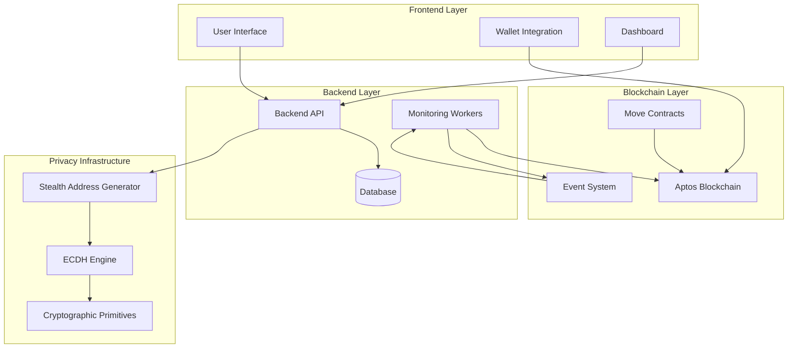
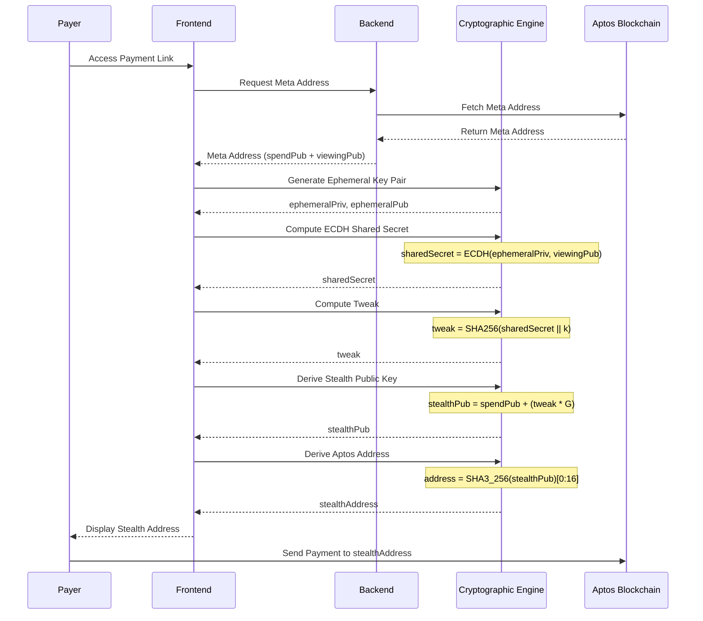
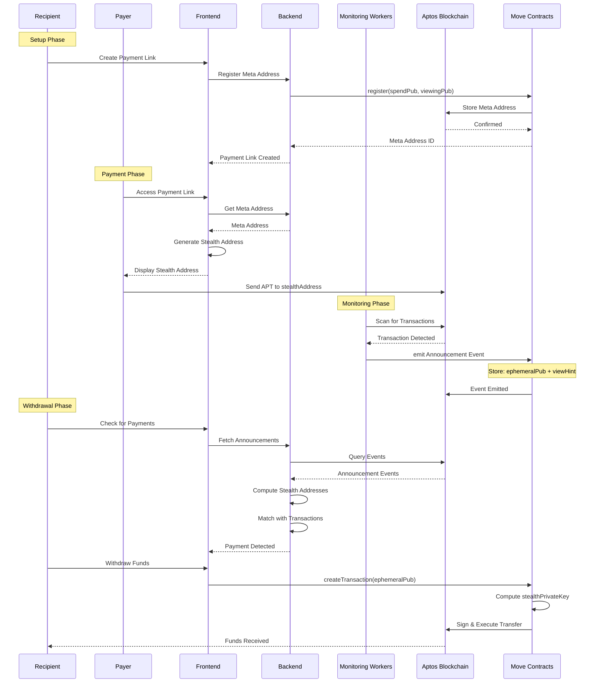
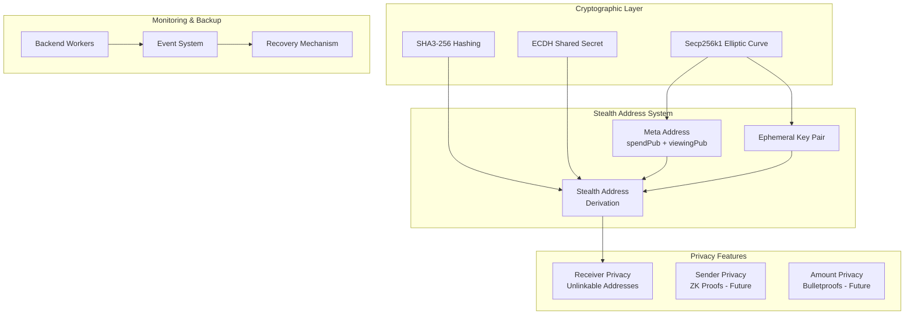
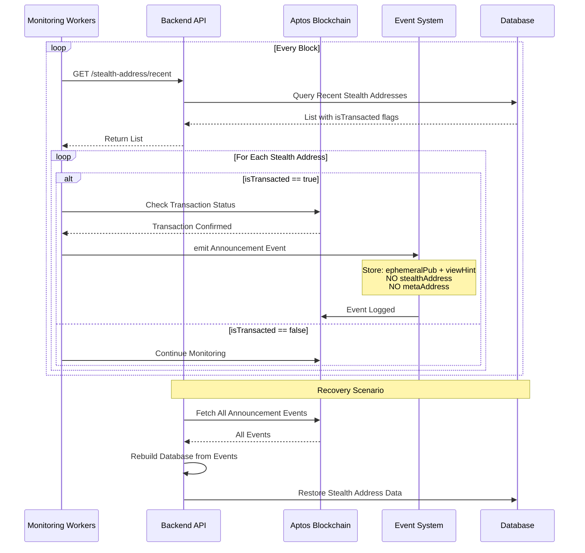
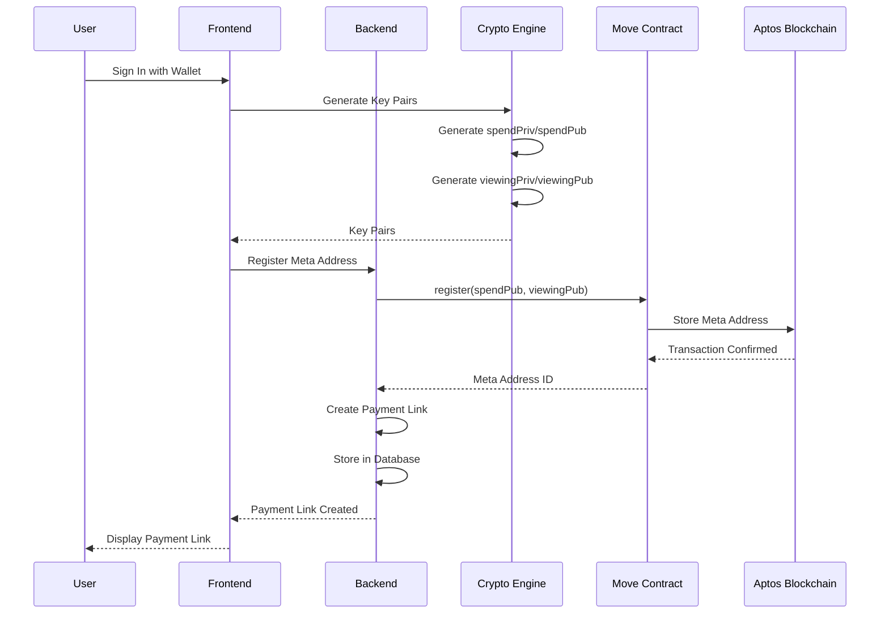
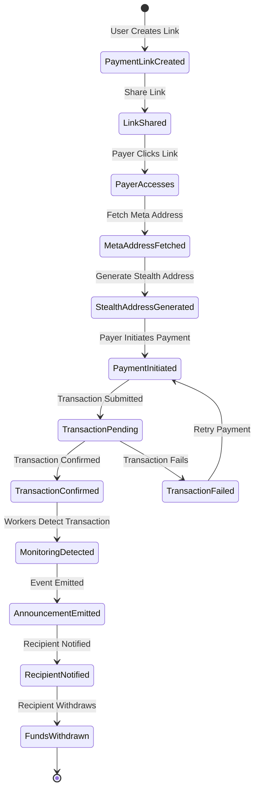
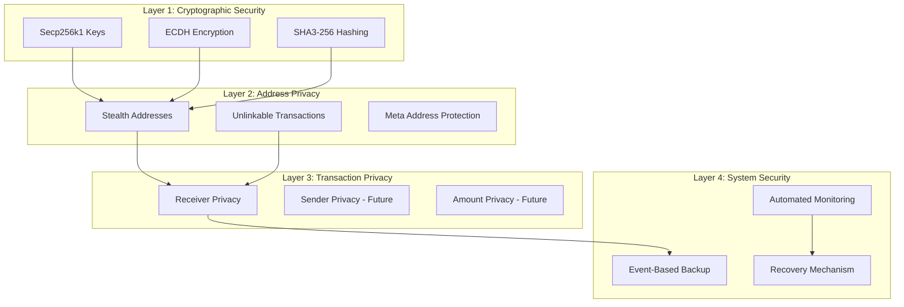

# Architecture Diagrams

## 1. High-Level System Architecture

## 2. Stealth Address Generation Flow

## 3. Payment Flow - Complete Process

## 4. Privacy Infrastructure Stack

## 7. Monitoring & Recovery System

## 8. User Registration & Meta Address Setup

## 9. Payment Link to Transaction Flow

## 11. Security & Privacy Layers

